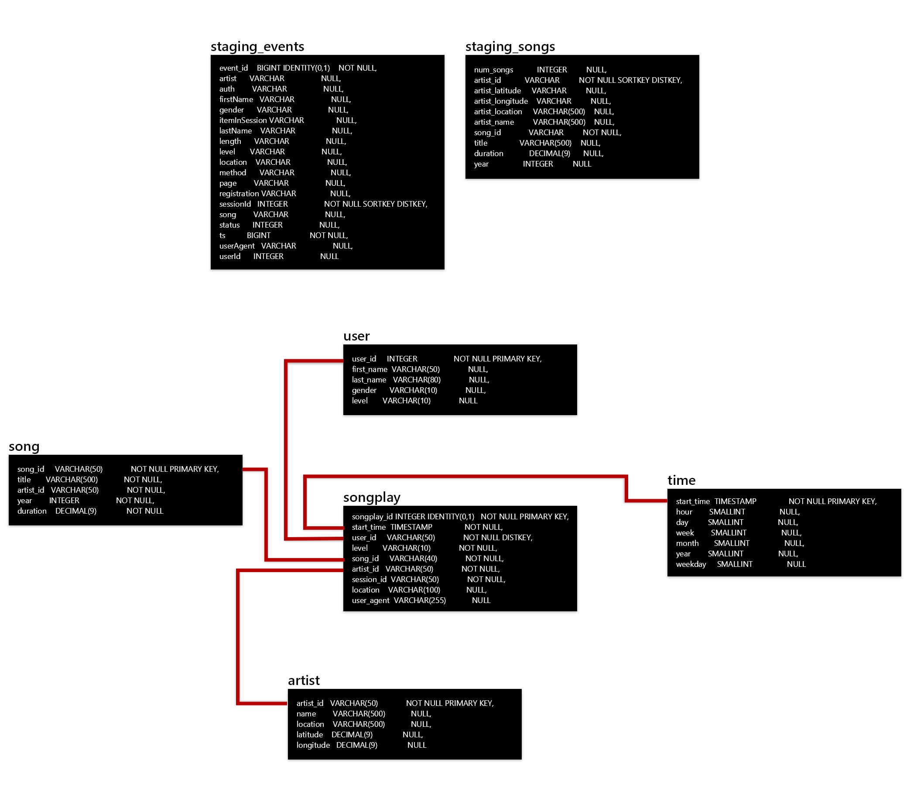
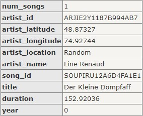

 

# Udacity Data Engineering Nanodegree | Data Lake Project

 

### *Arsalan Noorafkan*

**2021-06-01**
 
 

# **Overview**
## Background

A music streaming startup, Sparkify, has grown their user base and song database even more and want to move their data warehouse to a data lake. Their data resides in S3, in a directory of JSON logs on user activity on the app, as well as a directory with JSON metadata on the songs in their app.

As their data engineer, you are tasked with building an ETL pipeline that extracts their data from S3, processes them using Spark, and loads the data back into S3 as a set of dimensional tables. This will allow their analytics team to continue finding insights in what songs their users are listening to.

You'll be able to test your database and ETL pipeline by running queries given to you by the analytics team from Sparkify and compare your results with their expected results.

In this project, you'll apply what you've learned on Spark and data lakes to build an ETL pipeline for a data lake hosted on S3. To complete the project, you will need to load data from S3, process the data into analytics tables using Spark, and load them back into S3. You'll deploy this Spark process on a cluster using AWS.

##### ***These facts are for a fictional company that does not exist in real life***

 

## Purpose

As a startup, Sparkify's analytics team needs a fast and accurate process for answering questions that support business decisions. However, since the data collected from users is rapidly increasing as they grow the business, hence, the raw data needs to be cleaned, transformed, and prepared as a star schema optimized for queries on song play analysis. The ETL process helps the analytics team work with a relational database instead of raw JSON files. 

 

---

 

# **Schema**

The database will be structured as a star schema that comprises of a fact table with multiple dimension tables. This schema creates denormalized tables that help simplify queries and enable faster aggregations even when using lots of group by, joins, having, and where clauses. It must be noted that a star schema may be less flexible when working on ad-hoc queries and many-to-many relationships are not supported. 

### **Fact Table**
* songplays - records in event data associated with song plays i.e. records with page NextSong
      `songplay_id, start_time, user_id, level, song_id, artist_id, session_id, location, user_agent`

### **Dimension Tables**
* users - users in the app
      `user_id, first_name, last_name, gender, level`
* songs - songs in music database
      `song_id, title, artist_id, year, duration`
* artists - artists in music database
      `artist_id, name, location, lattitude, longitude`
* time - timestamps of records in songplays broken down into specific units
      `start_time, hour, day, week, month, year, weekday`

### **Schema Diagram** 

 
 
 

# **Instructions**
## Specifications
The ETL process comprises of the following technical specifications:
- Raw data is provided as JSON files stored in S3

    * SONG_DATA = 's3://udacity-dend/song_data'
      
        * song_data = s3a://udacity-dend/song_data/A/A/A/*.json
        * Sample data:
      
        
      
    
    * LOG_DATA = 's3://udacity-dend/log-data'
     
        * log_data = s3a://udacity-dend/log_data/2018/11/*.json
        * Sample data:
      
        
      
    
- ETL script is written in Python
    - Python libraries include PySpark (SQL Functions) and ConfigParser, DateTime, and OS.

- AWS resources: S3 bucket (for output parquet files) cluster and IAM role

 

## Project Structure
- dl.cfg: AWS Access Key ID and Secret Access Key
- etl.py: load data from S3 into staging tables stored in S3

  

## ETL Steps
The ETL process comprises of the following steps:

1) create_spark_session
    - initialize spark session builder
    - configure session parameters
    - create or get session if exists
2) process_song_data
    - loads input JSON files from S3: song_data 
    - extracts data columns
    - write songs and artists parquet files to S3
3) process_log_data
    - loads input JSON files from S3: log_data 
    - extracts data columns - dimension tables
    - extracts data columns - fact table
    - write user and time parquet files to S3

 

## Testing Script
Follow the steps below to test the ETL process using sample JSON data files.

The ETL process comprises of the following steps:

1) Install Python libraries

2) Create AWS resources
    - S3 bucket us-east-1
    - Enter AWS config and authentication information in the cl.cfg file

2) Open a terminal window and cd to the folder that contains the etl.py file
    > cd c:/usr/documents/Project1

3) Run the ETL process and stage the data for analysis by executing the following from the command line:
    >  `python etl.py`

 
REMINDER: Do not include your AWS access keys in your code when sharing this project!
 

---

 

